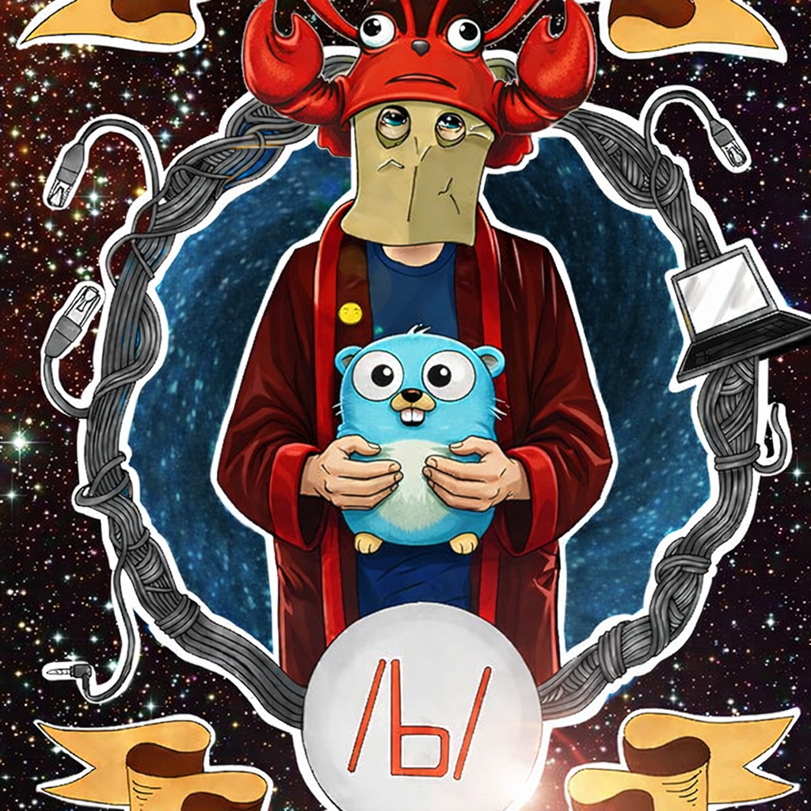

# omegagrid-agent-go

Pure Go rewrite of the [omegagrid-agent](https://github.com/nexusriot/omegagrid-agent) platform.
The gateway, agent loop, scheduler, Telegram bot, all 21 skills, vector memory, and conversation
history are compiled Go binaries — no Python sidecar.  A React web UI provides a browser
interface for chat, memory, skills, and the scheduler.  All source is self-contained in this
repository.

### /b/-lobster way on Go.

<p align="center" width="100%">
    
</p>

```
 Browser
    │ HTTP
    ▼
┌─────────────────────┐   HTTP    ┌──────────────────────────────────────────┐
│  frontend (nginx)   │ ────────► │   Go gateway                     :8000   │
│  React UI  :80      │           │                                          │
│  proxies /api/*     │           │  agent loop · scheduler · skills         │
└─────────────────────┘           │  vector memory · history                 │
         ▲                        └─────────────────┬────────────────────────┘
         │ Telegram Bot API                          │ HTTP
         │                                           ▼
         └──────────── telegram-bot (Go) ──► Ollama / OpenAI / OpenAI Codex
```

## Repository layout

```
cmd/
  gateway/              Go gateway entry point (HTTP API on :8000)
  cli/                  `omega` CLI — local or remote agent / skills / memory / scheduler
  telegram-bot/         Standalone Telegram bot binary
  migrate-vector/       One-shot ChromaDB → chromem-go migration tool
    main.go             Go importer (reads JSONL → writes chromem-go)
    export.py           Python exporter (reads ChromaDB → writes JSONL)
internal/
  agent/                Tool-calling loop (Run / RunStream); supports tool_calls batches
  bootstrap/            Single New() that wires every service (used by gateway + cli)
  config/               Env-driven configuration loader
  httpapi/              chi router + all REST handlers
  llm/                  Ollama + OpenAI chat clients (chat_completions & responses)
  memory/               In-process history (SQLite) + vector store (chromem-go)
    client.go           Public API — CreateSession / AddMemory / SearchMemory / …
    history.go          SQLite sessions + messages (modernc.org/sqlite, no CGO)
    vector.go           chromem-go vector store + SHA256 + cosine dedup pipeline
    embeddings.go       Ollama (3-endpoint fallback) + OpenAI embeddings clients
  observability/        Mark-based timer (surfaces in RunResult.Meta)
  scheduler/            SQLite store, cron matcher, runner, schedule_task skill
  skills/               In-process skill registry
    client.go           Public API — List() / Execute()
    registry.go         Thread-safe sync.RWMutex skill map
    builtin/            Go implementations of all 21 built-in skills
      web.go            weather, http_request, web_scrape, http_health, ip_info
      network.go        dns_lookup, ping_check, port_scan, whois_lookup
      encode.go         base64, hash, uuid_gen, password_gen, cidr_calc
      eval.go           datetime, math_eval (safe parser), cron_schedule
      exec.go           shell_command, ssh_command
      qr.go             qr_generate
    markdown/           Markdown skill loader + pipeline executor
  search/               Native web_search skill (DuckDuckGo HTML scrape, no API key)
  telegram/             Bot poller, command handlers, SQLite auth allowlist
web/                    React frontend — built by frontend container, served by nginx
  src/
    api/                TypeScript REST client, SSE stream helper, API types
    components/         Layout, SessionList, ChatBubble, ToolCard
    pages/              Chat, Memory, Skills, Scheduler, Health
    store/              Zustand chat + stream state
  package.json          Vite + React 18 + TypeScript + Tailwind project
docker/
  frontend.Dockerfile   node:20-alpine build → nginx:1.27-alpine serve
  gateway.Dockerfile    golang:1.25-bookworm build → distroless runtime (~19 MB)
  telegram.Dockerfile   golang:1.25-bookworm build → distroless runtime (~15 MB)
  migrate.Dockerfile    Two-stage: Python exporter + Go importer (migration only)
  nginx.conf            SPA routing + /api proxy + SSE streaming support
docker-compose.yml           3-service stack (frontend + gateway + telegram-bot)
docker-compose.migrate.yml   One-shot migration containers
Makefile               web / build / build-all / dev-web / vector-migrate targets
```

## Running with Docker Compose

```bash
cp .env.example .env
# edit .env  (LLM_PROVIDER, API keys, TELEGRAM_BOT_TOKEN, …)
docker compose up --build
```

| URL | What |
|---|---|
| `http://localhost/ui/` | React web UI (chat, memory, skills, scheduler, health) |
| `http://localhost/api/` | REST API proxied through nginx |
| `http://localhost:8000/` | Go gateway direct access |

Set `FRONTEND_PORT` (default `80`) or `BACKEND_PORT` (default `8000`) in `.env`
to use different host ports.

## Running locally (no Docker)

```bash
# 1. Go gateway  (serves /api/* and /health on :8000 — no UI)
LLM_PROVIDER=ollama OLLAMA_URL=http://127.0.0.1:11434 \
DATA_DIR=$PWD/data \
    go run ./cmd/gateway
# → http://localhost:8000/api/...

# 2. Web dev server with hot-reload  (proxies /api → :8000)
make dev-web
# → http://localhost:5173/ui/

# (optional) Telegram bot
TELEGRAM_BOT_TOKEN=... GATEWAY_URL=http://127.0.0.1:8000 \
    go run ./cmd/telegram-bot
```

### Makefile shortcuts

```bash
make web          # cd web && npm run build  (populates web/dist/)
make build        # web + go build -o bin/gateway
make build-all    # web + build gateway + telegram-bot + migrate-vector + omega CLI
make cli          # go build -o bin/omega ./cmd/cli
make dev-web      # cd web && npm run dev  (Vite dev server, hot-reload)
make vet          # go vet ./...
make vector-migrate   # ChromaDB → chromem-go migration (see below)
```

## CLI (`omega`)

A single static Go binary that exposes the full agent surface — agent queries,
skills, vector memory, scheduler, and session history — without requiring the
HTTP gateway to be running.

```bash
go build -o bin/omega ./cmd/cli
```

By default the CLI wires services in-process (same construction as the
gateway), reading the same `LLM_PROVIDER`, `DATA_DIR`, etc. env vars.  Set
`OMEGA_REMOTE=http://localhost:8000` to hit a running gateway over HTTP
instead.

```bash
# Local mode (in-process services)
omega ask "what's the weather in Berlin?" --stream
omega skills list
omega skills run weather --arg city=Berlin
omega memory search "kubernetes notes" -k 10
omega memory add "vlad prefers tabs" --meta tag=preference
omega schedule list
omega schedule create --name daily-news --cron "0 9 * * *" --skill web_search --arg query=hackernews
omega schedule delete 7
omega session list
omega session export 42 > session-42.json

# Remote mode (talks to a running gateway)
OMEGA_REMOTE=http://localhost:8000 omega ask "..."
```

`omega ask --stream` renders SSE events with ANSI color when stdout is a TTY
and falls back to plain text when piped (so `omega ask … | jq` works).

## Web UI pages

| Page | Path | Description |
|---|---|---|
| Chat | `/ui/` | Streaming agent chat with live tool-call cards, session sidebar, markdown rendering |
| Memory | `/ui/memory` | Semantic search + manual add to the vector store |
| Skills | `/ui/skills` | Browse all registered skills with parameter schemas; **skill playground** (▶ button) invokes any skill directly with auto-generated forms and shows pretty / raw / timing tabs |
| Scheduler | `/ui/scheduler` | CRUD for cron tasks: create, enable/disable, delete, view last result |
| Health | `/ui/health` | Live gateway + provider status, auto-refreshes every 30 s |

## What's in Go

Everything is compiled into the gateway binary (pure Go, no CGO, distroless runtime):

**Core platform:**
- HTTP gateway, REST API, SSE streaming
- Agent tool-calling loop with JSON recovery and **optional parallel tool calls** (`tool_calls` batch envelope, gated by `AGENT_PARALLEL_TOOLS`)
- Ollama + OpenAI (chat_completions & responses) LLM clients
- Cron scheduler (SQLite store, matcher, runner)
- Telegram bot with SQLite auth allowlist
- `omega` CLI binary with local + remote modes (`cmd/cli`)
- **Skill playground** endpoint (`POST /api/skills/{name}/invoke`) for invoking any skill directly without going through the agent loop

**Memory & history:**
- `HistoryStore` — SQLite sessions + messages (`modernc.org/sqlite`, CGO-free)
- `VectorStore` — chromem-go cosine-similarity memory with SHA256 + semantic dedup (0.08 threshold)
- Embeddings clients — Ollama (3-endpoint fallback) + OpenAI

**Built-in skills (21 total):**

| Skill | Description |
|---|---|
| `weather` | Current weather via Open-Meteo (no API key) |
| `datetime_skill` | Current UTC date and time |
| `http_request` | Arbitrary HTTP GET / POST |
| `web_scrape` | Fetch URL and extract readable text |
| `http_health` | HTTP endpoint health check with timing |
| `ip_info` | Geolocation for an IP via ip-api.com |
| `dns_lookup` | A / AAAA / MX / TXT / CNAME / NS lookup (`dig` + stdlib fallback) |
| `ping_check` | TCP connect reachability check |
| `port_scan` | Concurrent TCP port scanner (up to 1024 ports) |
| `whois_lookup` | WHOIS via raw TCP (IANA → authoritative server) |
| `base64_skill` | Encode / decode Base64 |
| `hash_skill` | MD5 / SHA1 / SHA256 / SHA512 |
| `uuid_gen` | UUID v1 / v3 / v4 / v5 |
| `password_gen` | Cryptographically secure password generator |
| `cidr_calc` | CIDR network details + IP membership check |
| `math_eval` | Safe expression evaluator (custom AST parser, no `eval`) |
| `cron_schedule` | Parse cron expression, explain it, show next N run times |
| `shell_command` | Local shell (requires `SKILL_SHELL_ENABLED=true`) |
| `ssh_command` | Remote SSH command (requires `SKILL_SSH_ENABLED=true`) |
| `qr_generate` | QR code as base64 PNG |
| `skill_creator` | Hot-register new skills from YAML + Markdown at runtime |

**Markdown / pipeline skills:**
Dynamic skills defined as `*.md` files in `SKILLS_DIR` (default `DATA_DIR/skills`).
`skill_creator` writes new `.md` files and hot-registers them without a restart.

## Migrating from a previous installation (Python sidecar → pure Go)

If you have an existing deployment with ChromaDB vector data, run the one-shot
migration before switching to the new stack.  No Python installation required
on the host — both steps run inside Docker.

```bash
# Run the full migration in one command:
make vector-migrate
```

This runs two containers sequentially:

1. **`migrate-export`** (Python 3.11 + chromadb==0.5.5) — reads
   `data/vector_db/` and writes every record to `data/vector_db.jsonl`.
   Embeddings are exported verbatim — no re-embedding, no model-version drift.

2. **`migrate-import`** (static Go binary) — reads the JSONL and writes a fresh
   chromem-go database at `data/chromem/`.

```
data/
  vector_db/        ← legacy ChromaDB (read by exporter; keep as backup)
  vector_db.jsonl   ← intermediate handoff file (safe to delete after migration)
  chromem/          ← new chromem-go database (used by gateway)
```

**Guard rails:**
- Refuses to overwrite a non-empty `data/chromem/`.  Remove it and re-run if needed.
- An empty source collection is a no-op (exits cleanly with "nothing to import").

**Manual steps (if `make` is not available):**

```bash
# Step 1 — export
docker compose -f docker-compose.migrate.yml run --rm --remove-orphans migrate-export

# Step 2 — import
docker compose -f docker-compose.migrate.yml run --rm --remove-orphans migrate-import

# Verify record count
wc -l data/vector_db.jsonl

# Clean up intermediate file
rm data/vector_db.jsonl
```

**New environment variable:**  the gateway now reads the vector database from
`AGENT_VECTOR_DIR` (default `DATA_DIR/chromem`) instead of the old
`AGENT_VECTOR_DIR` pointing at the ChromaDB directory.  If you customised
`AGENT_VECTOR_DIR` in `.env`, update it to point at `data/chromem`.

## Environment variables

| Variable | Default | Description |
|---|---|---|
| `BACKEND_PORT` | `8000` | Gateway listen port |
| `FRONTEND_PORT` | `80` | nginx listen port (Docker Compose only) |
| `DATA_DIR` | `/app/data` | Root directory for all persistent data |
| `LLM_PROVIDER` | `ollama` | `ollama` \| `openai` \| `openai-codex` |
| `OLLAMA_URL` | `http://127.0.0.1:11434` | Ollama server URL |
| `OLLAMA_MODEL` | `llama3:latest` | Ollama chat model |
| `OLLAMA_EMBED_MODEL` | `nomic-embed-text` | Ollama embeddings model (for vector memory) |
| `OLLAMA_TIMEOUT` | `120` | Ollama request timeout (seconds) |
| `OPENAI_API_KEY` | — | Required for `openai` / `openai-codex` provider |
| `OPENAI_BASE_URL` | `https://api.openai.com/v1` | OpenAI-compatible base URL |
| `OPENAI_CHAT_MODEL` | `gpt-4o-mini` | OpenAI chat model |
| `OPENAI_EMBED_MODEL` | `text-embedding-3-small` | OpenAI embeddings model (for vector memory) |
| `OPENAI_API_MODE` | auto | `chat_completions` \| `responses` (auto-selected for codex models) |
| `OPENAI_REASONING_EFFORT` | `medium` | Reasoning effort for the `responses` API |
| `OPENAI_TIMEOUT` | `120` | OpenAI request timeout (seconds) |
| `AGENT_DB` | `{DATA_DIR}/agent_memory.sqlite3` | Conversation history database |
| `AGENT_VECTOR_DIR` | `{DATA_DIR}/chromem` | chromem-go vector database directory |
| `AGENT_VECTOR_COLLECTION` | `memories` | Collection name inside the vector database |
| `AGENT_DEDUP_DISTANCE` | `0.08` | Cosine distance threshold for semantic deduplication |
| `AGENT_CONTEXT_TAIL` | `30` | Messages loaded from history per run |
| `AGENT_MEMORY_HITS` | `5` | Vector memory results injected into context |
| `AGENT_MAX_STEPS` | `25` | Maximum tool-call steps per agent run |
| `AGENT_PARALLEL_TOOLS` | `false` | Allow the LLM to emit `tool_calls` batches that execute concurrently |
| `AGENT_MAX_PARALLEL` | `4` | Max concurrent tool executions per batch when `AGENT_PARALLEL_TOOLS=true` |
| `PLAYGROUND_DISABLED` | `false` | Disable `POST /api/skills/{name}/invoke` (skill playground) |
| `OMEGA_REMOTE` | — | Base URL of a running gateway; switches the `omega` CLI from local to remote mode |
| `SKILLS_DIR` | `{DATA_DIR}/skills` | Directory for dynamic markdown skills |
| `SKILL_HTTP_TIMEOUT` | `30` | Timeout for HTTP-based skills (seconds) |
| `SKILL_SHELL_ENABLED` | `false` | Enable `shell_command` skill |
| `SKILL_SSH_ENABLED` | `false` | Enable `ssh_command` skill |
| `SKILL_SSH_IDENTITY_FILE` | — | Path to SSH private key file |
| `SKILL_SSH_DEFAULT_USER` | `root` | Default SSH username |
| `SKILL_SSH_PRIVATE_KEY` | — | PEM or base64-encoded PEM private key (alternative to identity file) |
| `SCHEDULER_DB` | `{DATA_DIR}/scheduler.sqlite3` | Scheduler database path |
| `SCHEDULER_TICK_SEC` | `60` | Scheduler poll interval (seconds) |
| `TELEGRAM_BOT_TOKEN` | — | Telegram bot token |
| `BOT_AUTH_ENABLED` | `false` | Enable Telegram user allowlist |
| `BOT_ADMIN_ID` | `0` | Telegram user ID of the admin |
| `GATEWAY_URL` | `http://127.0.0.1:8000` | Telegram bot → gateway base URL |

## Frontend / gateway separation

The gateway binary is a pure JSON API: it serves only `/health` and `/api/*`
and contains no static-file serving, no UI redirect, and no `//go:embed`
assets.  The React UI is built and served exclusively by the **frontend**
nginx service, which also reverse-proxies `/api/*` and `/health` back to
the gateway.  For UI development without Docker, run `make dev-web`
(Vite at `:5173`, proxying `/api` to the gateway on `:8000`).
